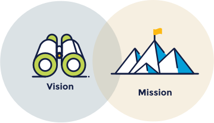

# Introduction

Over 15 thousand documents govern how the Department of Defense (DoD) operates. The documents exist in different repositories, often exist on different networks, are discoverable to different communities, are updated independently, and evolve rapidly. No single ability has ever existed that would enable navigation of the vast universe of governing requirements and guidance documents, leaving the Department unable to make evidence-based, data-driven decisions. Today GAMECHANGER offers a scalable solution with an authoritative corpus comprising a single trusted repository of all statutory and policy driven requirements based on Artificial-Intelligence (AI) enabled technologies.

#


### Vision

Fundamentally changing the way in which the DoD navigates its universe of requirements and makes decisions

### Mission
GAMECHANGER aspires to be the Department’s trusted solution for evidence-based, data-driven decision-making across the universe of DoD requirements by:

- Building the DoD’s authoritative corpus of requirements and policy to drive search, discovery, understanding, and analytic capabilities
- Operationalizing cutting-edge technologies, algorithms, models and interfaces to automate and scale the solution
- Fusing best practices from industry, academia, and government to advance innovation and research
- Engaging the open-source community to build generalizable and replicable technology

## License & Contributions
See LICENSE.md (including licensing intent - INTENT.md) and CONTRIBUTING.md

## Description
This repo contains the source code needed to build a java based plugin for neo4j. This allows for more efficient data ingest into the graph database.

## How to Build JAR
If you have Javac and Maven installed:
```
mvn clean package
```

Or using Docker:
```
# Linux/Mac
docker run -it --rm -v "$(pwd)":/usr/src/gc -w /usr/src/gc maven:3.8-jdk-11 mvn clean package

# Windows
docker run -it --rm -v "%CD%":/usr/src/gc -w /usr/src/gc maven:3.8-jdk-11 mvn clean package
```
The jar should be built at: `target/gamechanger-plugin-x.x-SNAPSHOT.jar`
## How to Setup Local Env for Development

TODO
